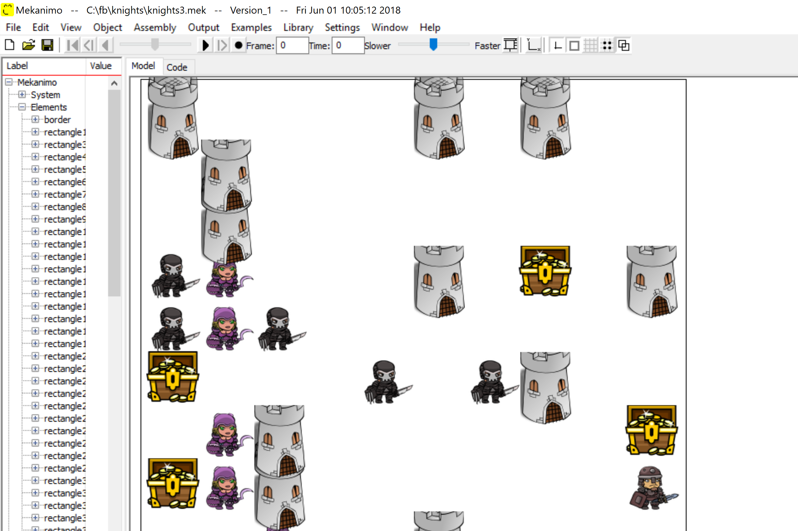

# Team: Game of Knights
Fahri, Mario, Aris, Angelos, George

# GameJam title: Idiotic Evolutionary Soldiers
(Based on the *Foragers* project)

## The idea
What if soldiers, mages and barbarians learn from their mistakes? What if technicians understand
what things they can copy with? What if generations over
generations your army learns how to act and react in different setting, helped by your
guidance, but acting on their free will? 

In the GameJam version of the system we:
- Use genetic algorithms to suggest *levels of different difficulties given an invading force*!
- Use random, greedy search to train *mighty idiotic knights who do (hopefully) better in randomly generated levels*!
- Integrate with the *Mekanimo engine to allow epic replays* (of epicly failing knights)!

# Prerequisites
- deap (you can download using pip)
- numpy (as always...)
- pygame (you can download using pip)
- termcolor (you can download using pip)

(and probably a few more that we do not have the time to check now... keep us updated!)

## Do not forget:
Python2 (yes, you read well!)
For Mekanimo, talk with Fahri!

# Running the simulation
python gameJamDemo.py

# Screenshots

